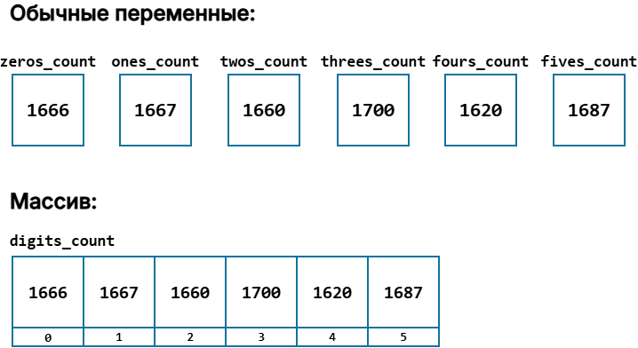
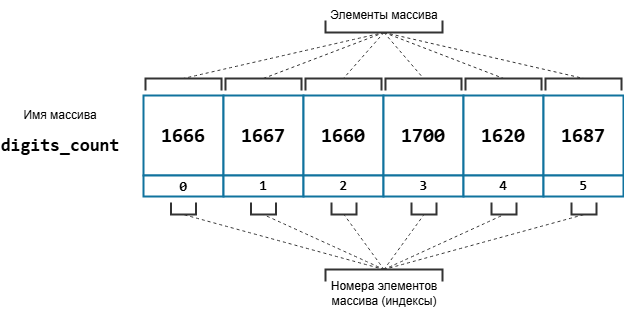
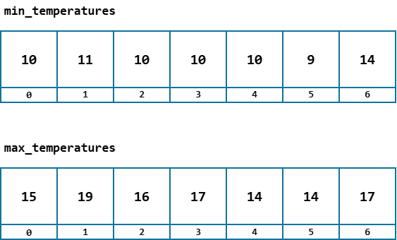
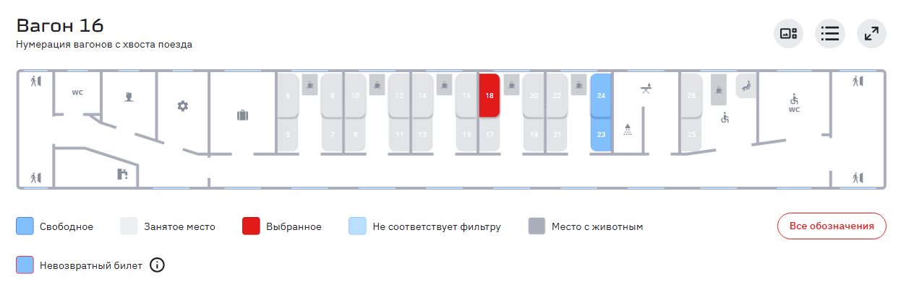
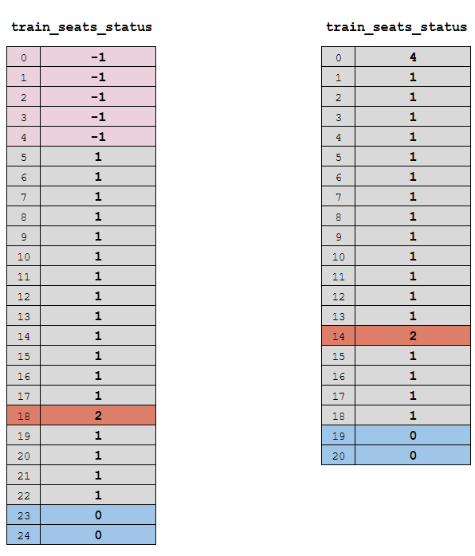
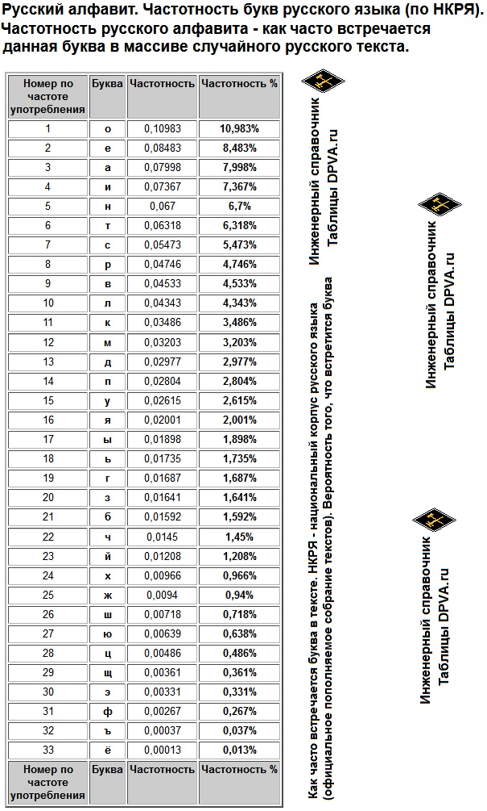
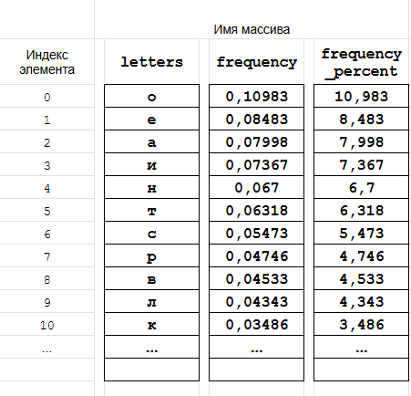

# Массивы

Начать этот урок я хочу с проблемы, с которой мы до сих пор не сталкивались. Я продемонстрирую её на примере программы для проверки распределения чисел, генерируемых функцией `rand`. Мы написали её несколько уроков назад, вот её исходник:

Листинг 1. 
```c
#include <stdio.h>
#include <stdlib.h>
#include <time.h>

int main(void)
{
        srand(time(NULL));
        
        // переменные для подсчёта нулей и единиц
        int zeros_count = 0, 
            ones_count = 0;

        int rand_number;

        for (int exp_num = 0; exp_num < 100; exp_num = exp_num + 1) {
                rand_number = rand() % 2;

                if (rand_number) {
                        ones_count = ones_count + 1;
                } else {
                        zeros_count = zeros_count + 1; 
                }
        } 

        printf("0 - %d\n1 - %d\n", zeros_count, ones_count);

        return 0;
}
```

Программа подсчитывает, сколько раз сгенерировано каждое из чисел `0` и `1`. Зададимся вопросом. Что делать, если нужно провести десять тысяч генераций для чисел от `0` до `5`? Изменить количество генераций с текущих `100` на `10000` довольно легко. А вот что делать с хранением этих `6` значений? На текущий момент единственный доступный нам вариант -- своя переменная на каждое значение. Т.е. завести переменные `twos_count`, `threes_count`, `fours_count` и `fives_count`. 

Этот подход сработает, но я надеюсь вы уже чувствуете, что это довольно костыльное решение. Ведь если мы захотим его масштабировать, например, решим генерировать числа от `0` до `100`, то придётся создавать уже сотню переменных, а точнее `101`. 

Но, допустим, что некто настолько безрассуден, что всё-таки решит создать `6` переменных (пусть даже не `101`). С настоящими трудностями этот безумец столкнётся, когда решит с этими шестью переменными что-нибудь сделать, например, найти какое из этих `6` чисел появлялось при генерации чаще или реже других, т.е. найти максимальное или минимальное из этих шести чисел. 

Надеюсь, мне удалось продемонстрировать вам нехватку нашего текущего инструментария. Если нет, то попробуйте написать программу, описанную выше. 

Обычные переменные хороши, когда надо сохранить какое-нибудь одиночное значение. Но если нам нужно хранить несколько однотипных значений, то набора отдельных переменных уже недостаточно. Нужны какие-то более навороченные переменные, которые позволят сохранить сразу несколько значений. И, конечно, программисты такие переменные придумали, их называют =массивами=.

=Массив= -- простейшая структура данных, предназначенная для хранения пронумерованного набора значений одного типа.

Вернёмся к нашей аналогии с ящиками. Если обычная переменная -- это один ящик, то массив -- это несколько одинаковых пронумерованных ящиков, которые сколочены между собой в один большой ящик. 



На рисунке как раз результат десяти тысяч генераций чисел от `0` до `5`. Сперва шесть отдельных переменных-счётчиков, а затем они же, собранные в один массив: в ящике с номером `0` лежит количество нулей (`1666`), в ящике `1` — количество единиц (`1667`) и так далее до пятёрок.

Обратите внимание, что у каждого ящика в массиве есть свой уникальный номер. Отдельные ящики, из которых состоит массив, называют =элементами массива=. Используя номер элемента (=индекс=), мы можем в программе работать с конкретным элементом массива.

У обычной переменной есть только имя и тип данных, а у массива к ним добавляется ещё одна важная характеристика:
- имя массива;
- тип данных, которые можно хранить в массиве;
- размер массива -- количество элементов в массиве.




На рисунке изображён целочисленный массив с именем `digits_count`. Он состоит из шести элементов, т.е. =размер массива= равен `6`. Каждый элемент массива может хранить одно значение целого типа `int`. К конкретному элементу массива обращаемся по имени массива и номеру: `digits_count[2]` — это третий элемент массива (третий ящик), т.к. нумерация элементов начинается с нуля.

Обратите внимание, что теперь обработать все элементы массива, например: найти среди них максимум или минимум, вывести их на экран, посчитать сумму — можно одним циклом `for`. Хоть шесть ящиков, хоть сто тысяч ящиков: тело цикла будет оставаться прежним, меняется только размер массива и количество итераций. Отдельные переменные так не умеют.

В следующих заметках этого урока мы научимся создавать массивы и работать с ними, а пока давайте посмотрим на примеры данных, для хранения которых удобно использовать массивы.

> **Пример 1.** Прогноз погоды на неделю
> 
> 

Для хранения минимальной и максимальной температур мы можем завести два целочисленных массива по `7` элементов: `min_temperatures` и `max_temperatures`. Индекс здесь — номер дня: `min_temperatures[0]` и `max_temperatures[0]` относятся к одному и тому же дню, `[1]` — к следующему и т.д.




> **Пример 2.** Бронирование билетов в вагоне поезда. Статус места: `0` -- свободно, `1` -- выкуплено, `2` -- забронировано.
> 
> 

Хранить данные о статусе мест можно в целочисленном массиве `train_seats_status`.



Обратите внимание, что на схеме вагона (Рис.5) места с `1` по `4` отсутствуют. При этом в языке Си, как и во многих других языках программирования, нумерация элементов массива **всегда** начинается с нуля. Чтобы избежать проблем, мы ввели дополнительный статус `-1` -- место отсутствует в вагоне, и присвоили этот статус первым пяти элементам с номерами `0`,`1`, `2`, `3` и `4`. 
Теперь, чтобы проверить статус какого-то места в вагоне, нам нужно обратиться к соответствующему элементу массива, например: `train_seats_status[18]` даст нам статус восемнадцатого места. Это `2`, т.е. место забронировано.

Можно было бы поступить и иначе (см. правую половину рисунка) и не резервировать отсутствующие места. Это уже задачка со звёздочкой. Подумайте, что означает четвёрка в нулевом элементе и как в таком массиве получить статус 18-го места?

> **Пример 3.** Анализ частотности букв русского алфавита в тексте

> 

Для хранения данных в этой задаче мы могли бы завести `3` массива по `33` элемента в каждом:

- `letters` -- массив с элементами типа `char` для хранения букв;
- `frequency` -- массив с элементами типа `double` для хранения частоты встречаемости соответствующих букв;
- `frequency_percent` -- массив с элементами типа `double` для хранения частоты встречаемости соответствующих букв в процентах;

Порядок в массивах тот же, что в таблице: не алфавитный, а по убыванию частоты (`о`, `е`, `а`, …). Отличие в том, что нумерация с нуля. Первая строка таблицы (номер `1`) попадает в элемент с индексом `0`, пятая — в элемент с индексом `4`.



При обращении к `letters[4]` (к элементу массива `letters` с номером `4`) мы получили бы значение `н`, в `frequency[4]` хранилось бы значение `0.067`, а в `frequency_percent[4]` -- значение `6.7`.


Итак, подытожим.

Массив -- простейшая структура данных, предназначенная для хранения пронумерованного набора значений одного типа. Нумерация элементов массива начинается с нуля. К элементу обращаемся по его имени и индексу, например: `letters[4]`. 

У массива три основных характеристики: 
- имя;
- тип данных;
- размер массива.

