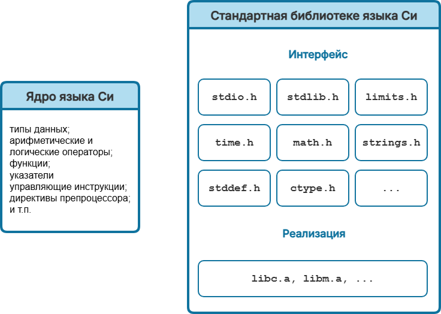

# Стандартная библиотека языка Си

В Курсе мы неоднократно используем различные стандартные функции, чтобы расширить возможности языка Си. Для этого мы подключаем соответствующие заголовочные файлы, например: 
- `stdio.h`, чтобы использовать функции `printf` и `scanf` для работы со стандартными потоками ввода и вывода;
- `math.h`, чтобы использовать в вычислениях математические функции `sqrt`, `pow`, `exp`, `fabs` и др.;
- `stdlib.h`, чтобы генерировать псевдослуайные числа с помощью функций `rand` и `srand`
- и другие. 

Все эти замечательные и полезные заголовочные файлы и функции не являются частью самого языка Си, а входят в так называемую =стандартную библиотеку языка Си=.

=Стандартная библиотека языка Си= -- это набор отдельных файлов (включая заголовочные файлы), которые расширяют возможности языка Си и обеспечивают переносимость программ. Все эти файлы мы получаем вместе с компилятором языка Си. 

У нас есть компактное ядро языка Си и дополнительный большой набор инструментов -- стандартная библиотека. 

Чтобы пользоваться этими инструментами мы подключаем в программе стандартные заголовочные файлы, которые в данном случае являются =интерфейсом= к основным библиотечным функциям.

Например, если вы откроете заголовочный файл `math.h` и попробуете найти в нём функцию `sqrt`, то вы обнаружите там только заголовок-прототип функции `sqrt` (потому .h файлы называются заголовочными), но не определение функции. Реализации этой и других стандартных математический функций мы получаем уже в скомпилированном виде в специальных библиотечных файлах, например, `libm.a` (для систем на базе `GNU/Linux`). На этапе компиляции происходит связывание (линковка) прототипов функций с их скомпилированными реализациями. 

С другими функциями стандартной библиотеки ситуация аналогичная. 

## Справочники функций

Где же брать информацию о том, какие функции предоставляет стандартная библиотека языка Си и как они работают? 

Есть несколько основных источников информации:
- стандарт языка Си (а точнее черновик стандарта, т.к. он обычно доступен бесплатно, а за стандарт надо платить);
- документация к компилятору или IDE;
- документация к операционной системе на базе GNU/Linux, через команду `man`, например: `man 3 prinf` выдаст справочную информация по функции `printf`. Эта же документация доступна и online;
- учебники и справочники по языку C, включая те, что размещены в сети;

Справочные материалы имеют похожую структуру и обычно включают в себя как минимум несколько стандартных разделов:
- описание;
- использование;
- возвращаемое значение;

Раздел **Описание** содержит описание того, для чего предназначена данная функция.

В разделе **Использование** указывается заголовочный файл, который требуется подключить, чтобы использовать данную функцию. Кроме того, здесь же описаны параметры, которые требуются функции для работы, а также тип возвращаемого значения.

Раздел **Возвращаемые значения** описывает, какие значения может вернуть функция и что они означают. 

Эти три раздела, обычно, под тем или иным именем присутствуют в любом справочнике или документации. Кроме них могут присутствовать и другие разделы, содержащие дополнительную информация о функции: пример использования, известные проблемы, в каком стандарте функция была добавлена, какие есть похожие функции и пр.