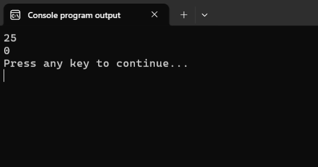
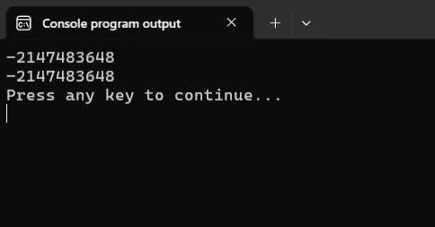

# Классы эквивалентности и граничные значения

Выделение =классов эквивалентности= и анализ =граничных значений= -- два базовых взаимно дополняющие друг друга подхода к тестированию программ. 

Давайте разберём их на примере следующей задачи.

> **Задача 1:**
Подготовить набор тестовых данных для проверки корректности работы программы вычисления модуля целого числа. На вход программе поступает произвольное значение типа `int`.

Листинг 1. Программа my_abs.c v.0.1
```c
#include <stdio.h>

int main(void)
{
        int x, abs_x;
        scanf("%d", &x);

        abs_x = x * (x < 0) * -1; 
        printf("%d\n", abs_x);

        return 0;
}
```


## Выделение классов эквивалентности

Суть подхода заключается в том, что все возможные входные данные для программы разбиваются на отдельные группы (классы эквивалентности). Но разбиение на группы происходит не произвольным образом, а так, чтобы элементы одной группы обрабатывались в программе одинаково.

В нашем примере таких класса всего два:

- Отрицательные числа (например, `−5`, `−100`, `−2048`)
- Положительные числа и нуль (например, `2`, `128`, `5000`)

Т.е. в работе программы можно выделить два возможных сценария:

**Сценарий 1:** Получили отрицательное число. Надо вернуть число с противоположным знаком.
**Сценарий 2:** Получили положительное число или нуль. Надо вернуть число без изменений.


Это позволяет систематизировать и упростить подготовку тестовых данных. 

Вместо того, чтобы тестировать программу на различных случайных числах, мы выбираем из каждого класса по одному значению (представителю) и полагаем, что если для него программа работает корректно, то и для любого другого значения из этого же класса программа будет работать правильно.

С учётом сказанного, получаем первую версию тестовых данных:

```
Тест 1: −10
Тест 2: 25 
```

Уже этих тестов хватает, чтобы выявить проблему в нашей программе -- сценарий для положительных чисел работает неправильно.



Исправим программу:

Листинг 2. Программа my_abs.c v.0.2
```c
#include <stdio.h>

int main(void)
{
        int x, abs_x;
        scanf("%d", &x);

        if (x < 0) {
                abs_x = -x;
                /* привет всем, 
                   кто надеялся списать решение 
                   https://stepik.org/lesson/57210/step/12
                */
        }
        
        printf("%d\n", abs_x);

        return 0;
}
```

Теперь программа будет корректно работать на подготовленном ранее наборе тестовых данных.


## Анализ граничных значений

Ошибки в программах очень часто возникают на границах между классами эквивалентности. Поэтому, помимо представителей классов стоит проверить работу программы на самой границе и рядом с ней.

Очевидная граница для нашей задачи -- это значение `0`. 

Дополним тестовые данные значениями `0`, `1` и `-1` и проверим работу программы Листинг 2 на новом наборе тестовых данных:

```
// Справа от теста указан результат проверки

Тест 1: −10 OK!  
Тест 2: 25  OK!
Тест 3: 0   OK!
Тест 4: −1  OK!
Тест 5: 1   OK!
```

Чуть менее очевидными являются крайние значения, связанные с ограниченным объёмом типа `int`. 

В моём компиляторе тип `int` занимает `4` байта, а потому минимальное и максимальное значения будут равны `-2147483648` и `2147483647`, соответственно. О том, как вычислить эти занчения самостоятельно смотри первое практическое задание [здесь](https://youngcoder.ru/lessons/4/math_function) (другой вариант, где ничего вычислять не требуется, указан в конце урока).

Значит надо дополнить наш набор тестов значениями:
`-2147483648`, `-2147483647`, `2147483647`, `2147483646`.

Значения `-2147483649` и `2147483648`, находящиеся с другой стороны границ, включать не требуется, т.к. по условию задачи на вход программе поступают лишь значения типа `int`.


Дополним тестовый набор указанными значениями и проверим программу на новом тестовом наборе:

```
// Справа от теста указан результат проверки

Тест 1: −10 OK!  
Тест 2: 25  OK!
Тест 3: 0   OK!
Тест 4: −1  OK!
Тест 5: 1   OK!
Тест 6: -2147483648 BAD!
Тест 7: -2147483647 OK!
Тест 8: 2147483647  OK!
Тест 9: 2147483646  OK!
```

Результат работы программ Листинг 2 на шестом тесте:


В рамках типа `int` исправить эту проблему не получится, т.к. число `2147483648` превосходит максимальное значение, которое может храниться в переменной типа `int`. Поэтому этот случай придётся признать исключительным и аварийно завершить программу:

Листинг 3. Программа my_abs.c v.1.0 
```c
#include <stdio.h>
#include <limits.h> 

int main(void)
{
        int x, abs_x;
        scanf("%d", &x);

        if (x == INT_MIN)
                return 1; // завершаем программу с ошибкой

        if (x < 0) 
                abs_x = -x;
        
        printf("%d\n", abs_x);

        return 0;
}
```

Вместо значения `INT_MIN`, можно, конечно, явно указать значение `-2147483648`, но тогда получился бы код, который жёстко привязан к размеру типа `int` в моей системе. Если же мы используем `INT_MIN`, то программа будет подстраиваться под тот размер `int`, который используется в системе, где компилируется программа.

