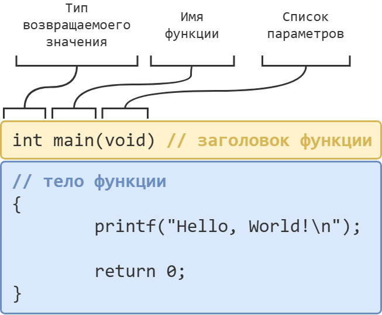
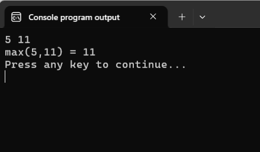
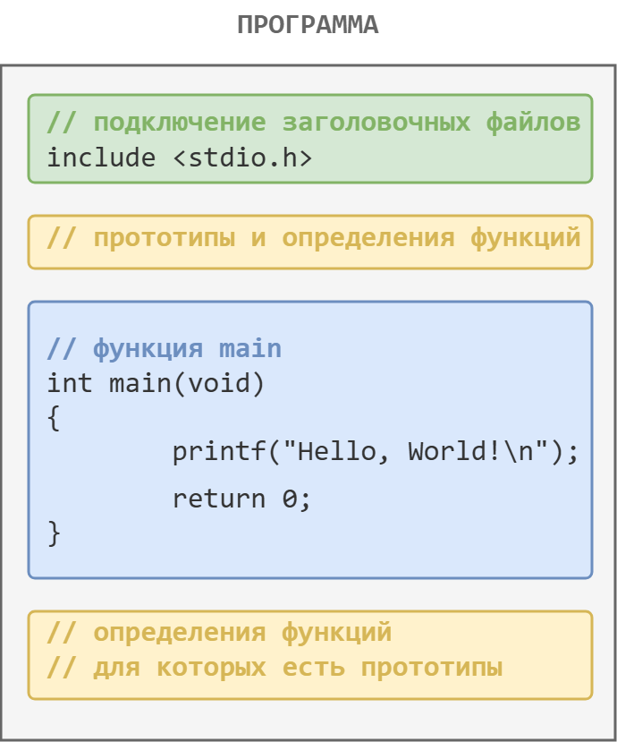

# Функции в языке Си

Что ж, давайте стряхнём пыль с наших знаний о функциях в C. Начнём с их внутренней структуры. 

## Как устроены функции в языке Си

Все функции в C, включая те, которые пишет пользователь, состоят из двух частей: =заголовка функции= и =тела функции=.

Заголовок любой функции включает в себя три обязательных компонента:
- тип возвращаемого значения;
- имя функции;
- список параметров, записанный в круглых скобках `()`




Разберём последовательно каждый элемент этой структуры. Начнём с заголовка. Для наглядности, будем разбирать заголовки уже знакомых нам функций: `rand`, `pow` и `srand`.

Листинг 2. Заголовки функций `rand`, `pow` и `srand`
```c
int rand(void) // заголовок функции rand

double pow(double base, double exp) // заголовок функции pow

void srand(int seed) // заголовок функции srand
```

### Тип возвращаемоего значения

Первым в заголовке функции указывается **тип возвращаемого значения** -- то, что функция «отдаёт» вызывающему коду после завершения работы. 

Из Листинга 2 видим, что функция `rand` возвращает значение типа `int`, функция `pow` из заголовочного файла `math.h`, возвращает значение типа `double`. Тут всё довольно просто.

Но мы уже с вами знаем примеры функций, которые никакого значения не возвращают, например, функция `srand`. В таком случае вместо типа возвращаемого значения пишут ключевое слово `void`.

Листинг 3.
```c
int rand(void)  // функция вернёт целое число

double pow(double base, double exp)  // функция вернёт вещественное число

void srand(int seed)  // функция ничего не возвращает
```


### Имя функции

После типа возвращаемого значения указывается =имя функции=. 

Мы используем имя функции, чтобы обратиться к функции (вызвать функцию) в любом месте программы. 

Имена функций подчиняются тем же правилам, что и имена переменных: только латиница, цифры и символ `_`. Причём имя не должно начинаться с цифры.

% **Рекомендация:**
- имя функции должно ясно отражать, что конкретно делает функция;


### Список параметров

В круглых скобках после имени функции перечисляют **формальные параметры** -- переменные, через которые функция получает данные от вызывающего её кода.

% **Важно!** Для каждого параметра в списке необходимо указать тип данных и имя.
`double pow(double base, double exp)` -- так можно!
`double pow(double base, exp)` -- так нельзя! Трубуется явно указать тип данных для параметра `exp`.

Вспоминаем аналогию с анкетой из первого урока. Параметры в заголовке -- это как «пустые графы анкеты». С их помощью программист, который создал эту функцию, сообщает всем остальным: **сколько** значений и **какого типа** принимает функция. 

А что же с функциями, которым не нужны параметры, например: `main`, `rand`? В таких случаях, как мы знаем с самого первого урока, вместо списка параметров в круглых скобках записывают ключевое слово `void`. 

Листинг 4. 
```c
int rand(void) // у функции rand нет параметров

double pow(double base, double exp) // функция принимает два значения типа double

void srand(int seed) // функция srand принимает одно значение типа int
```


### Тело функции

Тело функции -- это все инструкции языка Си, записанные внутри фигурных скобок `{}`. Здесь описывается всё то, что должна делать функция. 

### Инструкция `return`

Инструкция `return`, как мы уже знаем, используется для того, чтобы завершить текущую функцию и вернуть результат её работы в то место, где функцию вызвали. 

Так как раньше мы описывали только функцию `main`, то чаще всего мы просто -- почти не задумываясь -- писали `return 0;`. Понятно, что с помощью этой инструкции можно возвращать не только нуль, но и любое другое значение. 

Но мы же помним, что есть ещё и функции, которые не должны возвращать никакого значения (у них вместо типа возвращаемого значения записано слово `void`). Как же быть с ними? 

Тут всё довольно просто и прозаично. Самый распространённый вариант, когда в такой функции вообще нет инструкции `return`. В таком случае работа функции завершится, когда будут исполнены все инструкции, записанные в теле функции.

Но если по каким-то причинам выполнение функции требуется завершить досрочно (например, как в подходе с early returns), то тогда в этом месте пишут `return;` без какого-либо значения.


## Как создать пользовательскую функцию в Си?

Как и прежде, действует золотое правило: **прежде чем использовать что-нибудь в программе, надо это определить.** Поэтому, собственно, мы и подключаем заголовочные файлы, прежде чем использовать функции стандартной библиотеки такие как `printf`, `scanf`, `rand` и пр.  

А что значит определить функцию? 

=Определение функции (Function definitions)= -- это полное описание всей структуры функции: всех элементов заголовка функции и тела функции.

Таким образом, определить функцию означает подробно описать все структурные части функции. Кстати, иногда вместо определить функцию говорят описать =реализацию функции=.

Листинг 5. Общий синтаксис определения функции.
```c
тип_возвращаемого_значения имя_функции(список_параметров)
{
    // тело функции
}

```

### Где же допустимо определять функции в языке Си?

Самое очевидное место, где следует определять функции, понятно, **перед функцией `main`**, сразу после директив `#include`. 

Листинг 6. Программа с функцией max2
```c
#include <stdio.h>

// определение функции max2
int max2(int a, int b)
{
        int max = b;
        if (a > b) {
                max = a;
        }

        return max;
}

int main(void)
{
        int x = 0, y = 0, m = 0;

        scanf("%d %d", &x, &y);

        m = max2(x, y); // вызов функции max2

        printf("max(%d,%d) = %d\n", x, y, m);

        return 0;
}
```

Убедитесь, что эта программа работает.


Но для функций из общего правила, описанного выше, сделано небольшое исключение. 

Давайте представим, что у нас в программе будет, например, `10` пользовательских функций. Когда мы запишем их определения, то получится так, что код самой функции `main` окажется в самом конце файла. Вроде основная функция, а находится в таком неудачном месте. Как-то несолидно получается? 

Чтобы это избежать, можно до функции `main` записать =прототип функции= (иногда говорят =объявить функцию (function declaration)=), а уже реализацию функции написать в другом месте.

=Прототип функции= -- это заголовок функции с `;` в конце. Например, для функции `max2` прототип будет выглядеть так: `int max2(int a, int b);`.

Компилятор будет читать наш исходник сверху вниз. Когда он встретит вызов функции, он должен уже знать хотя бы её заголовок -- иначе выдаст ошибку. Если заголовок известен, то компилятор сможет: 
- проверить, что функция с таким именем существует;
- сверить количество аргументов и их типы;
- проверить тип возвращаемого значения.

Давайте перепишем Листинг 6 с использование прототипа функции `max2`.

Листинг 7. Использование прототипа функции `max2`
```c
#include <stdio.h>

// объявление функции (прототип функции) max2
int max2(int a, int b);

int main(void)
{
        int x = 0, y = 0, m = 0;

        scanf("%d %d", &x, &y);

        m = max2(x, y); // вызов функции max2

        printf("max(%d,%d) = %d\n", x, y, m);

        return 0;
}

// определение (реализация) функции max2
int max2(int a, int b)
{
        int max = b;
        if (a > b) {
                max = a;
        }

        return max;
}
```

Обратите внимание не терминологическую разницу между понятиями определение функции и объявление функции. Определить -- полностью описать, объявить -- описать только заголовок. Т.е. объявляя функцию мы как бы говорим компилятору: "не волнуйся, функция с таким именем существует, вот её заголовок, а реализация будет написана потом, мы об этом позаботимся". 

Итого, для программ, состоящих из одного файла, есть два основных места, где можно определять пользовательские функции:
- **перед функцией `main`**, сразу после `#include`.
- **после функции `main`**, но тогда перед функцией `main` надо добавить прототип.

Давайте отразим это на нашей карте со структурой программы из первого урока.



% **Важно!** 
Стандарт языка Си **запрещает** определять одну функцию в теле другой функции. 

Следующая программа скорее всего не скомпилируется, проверьте это самостоятельно:

Листинг 8.
```c
#include <stdio.h>

int main(void)
{

        // определение (реализация) функции max2
        int max2(int a, int b)
        {
                int max = b;
                if (a > b) {
                        max = a;
                }

                return max;
        }

        int x = 0, y = 0, m = 0;

        scanf("%d %d", &x, &y);

        m = max2(x, y); // вызов функции max2

        printf("max(%d,%d) = %d\n", x, y, m);

        return 0;
}
```

Итак, теперь мы разобрались с тем, как объявлять и определять пользовательские функции в языке Си. Давайте же на примере Листинга 5 разберём, как работатать с пользовательскими функции.

## Как происходит вызов функции

Мы уже знаем, для =вызова функции= требуется написать её имя и в круглых скобках передать ей требуемые для работы аргументы. 

Вот, например, вызов функции `max2` из Листинга 5: `m = max2(x, y);`

Кстати, иногда вместо "вызвать функцию" говорят "обратиться к функции". Выбирайте, как вам удобнее.


### Аргументы функции

Значения, которые передаются в функцию при вызове, называют =аргументами= (или =фактическими параметрами=). Это конкретные значения: числа, переменные, выражения.

% **Напоминание:**
**Параметры (формальные параметры) функции** -- то, что функция ожидает получить. Они описываются в определении функции.
**Аргументы (фактические параметры) функции** -- значения, которые функция реально получает при вызове.
Вспоминаем аналогию с анкетой из первого урока: пустые графы «Имя» и «Фамилия» -- формальные параметры. Записанные вами «Иван» и «Иванов» -- аргументы или фактические параметры.

В качестве аргументов можно использовать:
- литералы, например, конкретное число или символ: `max2(3, 5)`;
- переменные: `max2(x, y)`;
- выражения: `max2(x + 5, y * 2)`;
- вызов другой функции: `max2(rand(), 10)`.

Давайте разберём некоторые важные нюансы их на примере нашей программы из Листинга 5.

После запуска програмым мы вводим через пробел `5 11`. Функция `scanf` запишет числа `5` и `11` в переменные `x` и `y` соответственно.

Далее идёт строка, содержащая обращение к функции `max2`:
`m = max2(x, y);`

Переменной `m` надо присвоить то, что находится справа от знака `=`. Там у нас указано имя функции, которую мы создали сами. Проследим по шагам вызов этой функции.

**Шаг 1.** Для работы функции `max2` создаются две временные локальные переменные `a` и `b` типа `int`. Их область видимости и время жизни ограничены функцией `max2`. 

**Шаг 2.** В переменные `a` и `b` копируются значения из аргументов функции. 
Т.к. у нас в качестве аргументов выступают переменные `x` и `y`, то в локальные переменные `a` и `b` будут скопированы значения переменных `x` и `y`, т.е. числа `5` и `11`.

% **Нюанс 1:** Обратите внимание, что в функцию передаются не сами аргументы, а только копии их значений. Это стандартный механизм языка Си, который называется =передача по значению (pass by value)= или =вызов функции с передачей значений=. 

**Шаг 3.** Последовательно выполняется тело функции `max2`. 

Сначала создаётся целочисленная переменная с именем `max` и ей присваивается значение, записанное в переменной `b`, т.е. теперь `max = 11`. Мы предположили, что в переменной `b` записано большее из чисел.

Затем мы проверяем своё предположение. Для этого проверяем условие `a > b`. Истинность этого условия сказала бы нам, что наше исходное предположение было ошибочным, а значит значение в переменной `max` надо заменить значение из переменной `a`.

В нашем случае, `a = 5`, а `b = 11`, значит `a > b`  ложно. Поэтому дополнительных действий не требуется. Следовательно, когда мы доходим до инструкции `return`, в переменной `max` записано значение `11`.

**Шаг 4.** Возврат из функции.

Инструкция `return max;` возвращает в вызывающую программу (функцию `main`) значение, записанное в переменной `max`. В нашем случае это число `11`.

**Шаг 5.** Уничтожение локальных переменных.
Работа функции завершается, а локальные переменные `a` `b`, `max` удаляются из памяти.

% **Важно!** Обратите внимание, что все переменные, объявленные внутри функции являются локальными (включая и переменные из параметров). Они доступны только внутри функции в которой они объявлены, или говоря на профессиональном жаргоне: область видимости этих переменных ограничена телом функции, а время жизни -- временем пока выполняется функция.

**Шаг 6.** На место вызова функции в `main` подставляется значение, которое вернула функция `max2`. Т.е. выражение `m = max(x, y);` превращается в `m = 5;`.

% **Нюанс 2:** Вы должны самостоятельно следить за тем, чтобы:
- тип аргумента соответствовал типу формального параметра.
- тип возвращаемого значения совпадал с типом в заголовке функции.

Компилятор, конечно, тоже за этим следит. В некоторых простых случаях, если он заметит расхождение, то покажет вам предупреждение и выполнит неявное приведение типов, как при присваивании. При этом, как обычно, возможна потеря точности. Если же приведение типа выполнить невозможно, то вы получите ошибку компиляции. 

Ниже я написал несколько различных вариантов реализаций функции `max2`, которые иллюстрируют различные дополнительные возможности работы с функциями.

Листинг 9.
```c
int max2(int a, int b)
{
        // две точки выхода из функции
        if (a > b) {
                return a;
        } else {
                return b;
        }
}
```

В этом варианте, мы убрали переменную `max` и сразу возвращаем большее из значений.

Листинг 10.
```c
int max2(int a, int b)
{
        return (a > b) ? a : b;
}
```

Для простые вычисления можно делать прямо в инструкции `return`. Но на первых порах этим лучше не увлекаться. В этом примере мы проводим вычисления с помощью тернарного оператора `? :` прямо внутри инструкции `return`.

А теперь посмотрим, как пользовательские функции могут вызывать друг друга. Давайте усовершенствуем нашу программу и добавим в неё функцию, которая вычисляет максимум из трёх чисел.

Листинг 11:
```c
#include <stdio.h>

// прототипы функций
int max2(int a, int b);
int max3(int a, int b, int c);

int main(void)
{
        int x = 0, y = 0, z = 0, m = 0;

        scanf("%d %d %d", &x, &y, &z);

        m = max3(x, y, z); // вызов функции max3

        printf("max(%d,%d,%d) = %d\n", x, y, z, m);

        return 0;
}

// реализация функции max2
int max2(int a, int b)
{
        return (a > b) ? a : b;
}

// реализация функции max3
int max3(int a, int b, int c)
{
        int max_ab = max2(a, b);
        return (max_ab > c) ? max_ab : c;

        /* а можно даже вот так:
           return max2(max_ab, c);
           return max2(max2(a, b), c);
           return max2(a, max2(b, c));
        */
}
```

В этом примере надо обратить внимание на два момента.

Во-первых, посмотрите как ловко можно воспользоваться уже готовой функцией `max2`, чтобы написать функцию `max3`. Прикольно, не так ли? 

Во-вторых, обратите внимание, что в функциях `max2` и `max3` использованы одинаковые имена локальных переменных `a` и `b`. Т.к. переменные имеют локальную область видимости и время жизни, то так вполне можно делать и никаких ошибок не будет.
