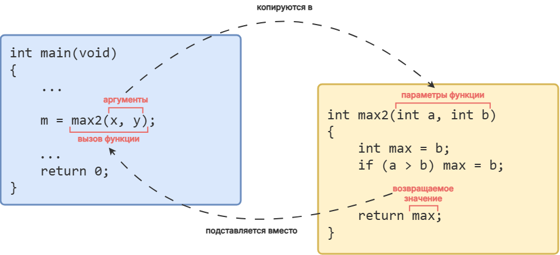

# Функции в языке Си

Давайте повторим и систематизируем всё, что мы знаем о функциях.

## Как устроены функции в языке Си

Все функции в C, включая те, которые пишет пользователь, состоят из двух частей: =заголовка функции= и =тела функции=.

Заголовок любой функции включает в себя три обязательных компонента:
- тип возвращаемого значения;
- имя функции;
- список параметров, записанный в круглых скобках `()`


Давайте разберём заголовки уже знакомых нам функций `rand`, `pow` и `srand`.

Листинг 1. Заголовки функций `rand`, `pow` и `srand`
```c
int rand(void) // заголовок функции rand

double pow(double base, double exp) // заголовок функции pow

void srand(int seed) // заголовок функции srand
```

### Тип возвращаемоего значения

Первым в заголовке функции указывается **тип возвращаемого значения**.

В Листинге 1 мы видим, что функция `rand` возвращает значение типа `int`, функция `pow` возвращает значение типа `double`. Тут всё довольно просто.

Чтобы показать, что функция не возвращает никакого значения, на этом месте пишут ключевое слово `void`. Для примера посмотрите на заголовок функции `srand`. 

### Имя функции

**Имя функции** записывается после типа возвращаемого значения. 

Мы используем имя функции, чтобы обратиться к функции (вызвать функцию). Каждая функция должна иметь своё уникальное имя. В имени функции можно использовать: английский буквы, цифры и символ `_`. Причём имя не должно начинаться с цифры.

% **Рекомендация:**
- называйте ваши функции так, чтобы по имени функции было понятно, что конкретно делает функция.

### Список параметров

В круглых скобках после имени функции необходимо перечислить **формальные параметры**. Так мы сообщаем компилятору, **сколько** значений и **какого типа** ожидает функция от того кода, который её вызывает.

% **Важно!** Параметры перечисляются через запятую. Для каждого параметра необходимо указать: тип данных и имя.
%
% `double pow(double base, double exp)` -- правильно.
  `double pow(double base, exp)` -- ОШИБКА! Нужно явно прописать тип данных для параметра `exp`.

А что же делать, если нашей функции не нужны параметры? В таких случаях, как мы знаем с самого первого урока, вместо списка параметров в круглых скобках нужно записыть ключевое слово `void`. 

Листинг 2. 
```c
int rand(void) // у функции rand нет параметров

double pow(double base, double exp) // функция pow принимает два значения типа double

void srand(int seed) // функция srand принимает одно значение типа int
```

### Тело функции

**Тело функции** -- всё, что записано внутри фигурных скобок `{}` сразу после заголовка функции. Здесь мы описываем все те действия, которые должна выполнить функция.


## Как создать пользовательскую функцию в Си?

Золотое правило программирования гласит: **прежде чем использовать что-нибудь в программе, надо это определить.** 

А что значит "определить" функцию? 

=Определение функции (function definitions)= -- это полное описание всей структуры функции: заголовка и тела функции.

Таким образом, определить функцию означает подробно описать все структурные части функции. Кстати, иногда вместо определить функцию говорят описать =реализацию функции=.

Листинг 3. Общий синтаксис определения функции.
```c
тип_возвращаемого_значения имя_функции(список_параметров)
{
    // тело функции
}

```

### Где допустимо определять функции в языке Си?

Самое очевидное место, где следует определять функции, понятно, **перед функцией `main`**, сразу после директив `#include`. 

Листинг 4. Программа с функцией max2
```c
#include <stdio.h>

// определение функции max2
int max2(int a, int b)
{
        int max = b;
        if (a > b) {
                max = a;
        }

        return max;
}
// конец определения функции max2

int main(void)
{
        int x = 0, y = 0, m = 0;

        scanf("%d %d", &x, &y);

        m = max2(x, y); // вызов функции max2

        printf("max(%d,%d) = %d\n", x, y, m);

        return 0;
}
```

Убедитесь, что эта программа работает.


Теперь представим, что у нас в программе, например, `10` пользовательских функций. Когда мы запишем их определения, то код самой функции `main` опустится в самый конец исходника. Вроде самая главная функция, а находится в таком непочётном месте. Как-то несолидно получается. 

Поэтому для функций сделано небольшое исключение из общего правила, описанного выше.

Разрешается до функции `main` записать =прототип функции= (иногда говорят =объявить функцию (function declaration)=), а реализацию функции написать в другом месте.

=Прототип функции= -- это заголовок функции с `;` в конце. Например, для функции `max2` прототип будет выглядеть так: `int max2(int a, int b);`.

Когда компилятор встречает в тексте программы вызов функции, то он должен: 
- проверить, что функция с таким именем действительно существует;
- сверить количество передаваемых параметров и их типы;
- проверить тип возвращаемого значения при необходимости.

Для этих целей ему достаточно будет и прототипа. Если же компилятор видит вызов функции, но ранее по тексту программы он не встречал ни прототипа, ни определения функции, то он выдаст ошибку.

Давайте перепишем Листинг 4 с использование прототипа функции `max2`.

Листинг 5. Использование прототипа функции `max2`
```c
#include <stdio.h>

// объявление (прототип) функции max2
int max2(int a, int b);

int main(void)
{
        int x = 0, y = 0, m = 0;

        scanf("%d %d", &x, &y);

        m = max2(x, y); // вызов функции max2

        printf("max(%d,%d) = %d\n", x, y, m);

        return 0;
}

// определение (реализация) функции max2
int max2(int a, int b)
{
        int max = b;
        if (a > b) {
                max = a;
        }

        return max;
}
```

Обратите внимание, что понятия "определить функцию" и "объявить функцию" не эквивалентны. Определить -- полностью описать, объявить -- описать только прототип. Т.е. объявляя функцию мы как бы говорим компилятору: "не волнуйся, функция с таким именем существует, вот её прототип, а реализация будет написана потом, мы об этом позаботимся". 

Итого, для программ, состоящих из одного файла, есть два основных места, где можно определять пользовательские функции:
- **перед функцией `main`**;
- **после функции `main`**, но тогда перед функцией `main` надо добавить прототип.

Давайте отразим это на нашей карте со структурой программы из первого урока.


% **Важно!** 
Стандарт языка Си **запрещает** определять одну функцию в теле другой функции.

Следующая программа скорее всего не скомпилируется, проверьте это самостоятельно:

Листинг 6.
```c
#include <stdio.h>

int main(void)
{
        // определение функции max2 внутри main
        int max2(int a, int b)
        {
                int max = b;
                if (a > b) {
                        max = a;
                }

                return max;
        }

        int x = 0, y = 0, m = 0;

        scanf("%d %d", &x, &y);

        m = max2(x, y); // вызов функции max2

        printf("max(%d,%d) = %d\n", x, y, m);

        return 0;
}
```

Разобравшись с тем, как объявлять и определять пользовательские функции в языке Си, давайте обсудим, как устроен вызов функций.


## Как происходит вызов функции

После того, как мы определили функцию, мы можем вызывать её сколько угодно раз в любом месте программы. Кстати, иногда вместо "вызвать функцию" говорят "обратиться к функции".

Чтобы =вызвать функцию= нужно написать её имя а затем в круглых скобках `()` указать аргументы, которые мы хотим передать функции. 

Например: `sqrt(25)`, `max2(x, y)`. 

Если функции для работы не нужны никакие параметры (т.е. в заголовке функции вместо списка параметров указано `void`), то для вызова такой функции нужно написать только её имя и круглые скобки, например: `rand()`.

% **Частая ошибка: ** Новички иногда пишут что-то вроде `rand(void)`. Это ошибка. `void` используется только в определении функции, для вызова он не нужен. Просто оставьте скобки пустыми.


### Аргументы функции

Значения, которые передаются в функцию при вызове, называют =аргументами= (или =фактическими параметрами=) функции.

% **Напоминалка:**
%
- **Параметры (формальные параметры) функции** -- то, что функция ожидает получить. Мы описываем их в заголовке функции, когда пишем её определение.
- **Аргументы (фактические параметры) функции** -- конкретные значения, которые реально передаются в функция при её вызове.
%
Вспоминаем аналогию с анкетой из первого урока: пустые графы «Имя» и «Фамилия» -- это формальные параметры. Вписанные в анкету конкретные значения «Гилл» и «Байтс» -- это аргументы или фактические параметры.

В качестве аргументов можно использовать:
- конкретные значения: `max2(3, 5)`;
- переменные: `max2(x, y)`;
- выражения: `max2(x + 5, y * 2)`;
- вызовы других функции: `max2(rand(), 10)`;
- всё, перечисленное выше, вперемешку: `max2(x + rand(), 3 * y)`.

### Возврат значения из функции. Инструкция `return`

Раньше мы использовали инструкцию `return` для того, чтобы завершить работу функции `main` и вернуть значение `0` в операционную систему.

Эта же самая инструкция используется для завершения работы любой функции. При этом, конечно, мы можем возвращать любое значение, а не только нуль.

Листинг 7. Общий синтаксис инструкции `return`
```c
return возвращаемое_значение;
```

% **Важно!** Если в определении функции указан тип возвращаемого значения, то в теле функции обязательно должна быть хотя бы одна инструкция `return`.

Ране мы упоминали, что существуют функции, которые не должны возвращать никакого значения (у них вместо типа возвращаемого значения записано слово `void`). Иногда их называют `void`-функциями. Как же быть с ними? 

Самый распространённый вариант -- просто не использовать инструкцию `return` в теле `void`-функции. В таком случае работа функции завершится после того, как будут исполнены все инструкции, записанные в теле функции.

Если по каким-то причинам выполнение `void`-функции требуется завершить досрочно (например, как в подходе с early returns), то в этом случае просто пишут  `return;` без какого-либо значения.


Разберём подробно, как происходит вызов функции на примере программы из Листинга 5.

Допустим, что после запуска програмым мы ввели `5 11`. Функция `scanf` запишет значения `5` и `11` в переменные `x` и `y` соответственно.

Далее идёт строка, содержащая обращение к функции `max2`:
`m = max2(x, y);`

Переменной `m` надо присвоить то, что находится справа от знака `=`. Там у нас указано записан вызов функции `max2`. Проследим по шагам, что будет происходить в программе.

**Шаг 1.** Подготовка аргументов функции. 
Переменные заменяются на их текущие значения и проводятся вычисления выражений, если это необходимо. В нашем случае мы просто заменяем переменные их текущими значениями, т.е. `max2(x, y)` превращается в `max2(5, 11)`. Когда аргументы готовы, управление передаётся функции `max2`.

**Шаг 2.** Подготовка локальных переменных в соответствии со списком параметров.
Функция `max2` создаёт две временные локальные переменные `a` и `b` типа `int`. Их область видимости и время жизни ограничены функцией `max2`. В переменные `a` и `b` копируются значения, вычисленные на первом шаге.

% **Важно!** Обратите внимание, что в функцию передаются не сами аргументы, а только копии их значений. Это стандартный механизм языка Си, который называется =передача по значению (pass by value)= или =вызов функции с передачей значений=. 

**Шаг 3.** Выполняется тело функции.

После того, как всё готово, выполняется тело функции `max2`. 

Сначала создаётся целочисленная переменная с именем `max` и ей присваивается значение, записанное в переменной `b`, т.е. теперь `max = 11`. Мы как бы предполагаем, что в переменной `b` записано большее из чисел.

Затем мы проверяем условие `a > b`. Если оно истинно, значит мы ошиблись в нашем предположении и значение в переменной `max` надо заменить значением из переменной `a`.

У нас `a = 5`, а `b = 11`, значит `a > b`  ложно. Поэтому дополнительных действий не требуется. Следовательно, когда мы доходим до инструкции `return`, в переменной `max` хранится значение `11`.

**Шаг 4.** Возврат из функции и уничтожение локальных переменных.

Инструкция `return max;` возвращает в вызывающую программу (функцию `main`) значение, записанное в переменной `max`. В нашем случае это число `11`. После чего работа функции `max2` завершается, а локальные переменные `a` `b` и `max` удаляются.

% **Важно!** Обратите внимание, что все переменные, объявленные внутри функции являются локальными (включая и переменные из параметров). Они доступны только внутри этой функции. Говоря на профессиональном жаргоне: область видимости этих переменных ограничена телом функции, а время жизни -- временем выполнения функция.

**Шаг 6.** Вызов функции `max2(5, 11)` заменяется значением, которое вернула функция `max2`. 

Таким образом, после того, как функция `max2` отработала выражение `m = max2(x, y);` превращается в `m = 11;`.

% **Важно!** Программист должен самостоятельно следить за тем, чтобы:
- тип аргумента соответствовал типу формального параметра.
- возвращаемое значение соответствовало тому типу, который указан в заголовке функции.

Компилятор, конечно, тоже за этим следит. В некоторых простых случаях, если он заметит расхождение, то покажет вам предупреждение и выполнит неявное приведение типов, как при присваивании. При этом, как обычно, возможна потеря точности. Если же приведение типа выполнить невозможно, то вы получите ошибку компиляции. 

Завершим рассказ о вызове функций, кратким описанием того, как происходит вызов функции:

1. Подготовка аргументов функции. Должны остаться только конкретные значения. Передача управления функции.
2. Функция создаёт локальные переменные в соответствии со списком параметров и копирует туда значения из аргументов.
3. Выполняется тело функции.
4. Возврат значения, передача управления вызывающей программе и удаление локальных переменных.
5. Замена вызова функции значением, которое она вернула.

Для `void`-функций пункт `5` не выполняется, а 4 пункт состоит в удалении локальных переменных и передаче упрваления вызывающей программе. 



Рассмотрим несколько вариантов реализаций функции `max2`, которые проиллюстрируют дополнительные возможности функций.

Листинг 8.
```c
int max2(int a, int b)
{
        // две точки выхода из функции
        if (a > b) {
                return a;
        } else {
                return b;
        }
}
```

В этом варианте, мы убрали переменную `max` и сразу возвращаем большее из значений.

Листинг 9.
```c
int max2(int a, int b)
{
        return (a > b) ? a : b;
}
```

Простые вычисления можно делать прямо в инструкции `return`. Но на первых порах этим лучше не увлекаться. 

В этой реализации мы проводим вычисления с помощью тернарного оператора `? :` прямо внутри инструкции `return`.

Посмотрим, как пользовательские функции могут вызывать друг друга. Давайте усовершенствуем нашу программу и добавим в неё функцию, которая вычисляет максимум из трёх чисел.

Листинг 10.
```c
#include <stdio.h>

// прототипы функций
int max2(int a, int b);
int max3(int a, int b, int c);

int main(void)
{
        int a = 0, b = 0, c = 0, m = 0;

        scanf("%d %d %d", &a, &b, &c);

        m = max3(a, b, c); // вызов функции max3

        printf("max(%d,%d,%d) = %d\n", a, b, c, m);

        return 0;
}

// реализация функции max2
int max2(int a, int b)
{
        return (a > b) ? a : b;
}

// реализация функции max3
int max3(int a, int b, int c)
{
        int max_ab = max2(a, b);
        return max2(max_ab, c);

        /* Или даже в одну строку:
           return max2(max2(a, b), c);
           return max2(a, max2(b, c));
        */
}
```

В этом примере надо обратить внимание на два момента.

Во-первых, посмотрите как ловко мы использовались уже готовой функцией `max2`, чтобы написать функцию `max3`.

Во-вторых, обратите внимание, что в функциях `max2` и `max3` использованы одинаковые имена локальных переменных `a` и `b`. Кроме того, в функции `main` также используются переменные с именами `a`, `b` и `c`. При этом программа работает корректно. 

Это происходит из-за того, что переменные, объявленные в функции (в том числе и в функции `main`), имеют локальную область видимости. Например, функция `main` ничего не знает о переменных, которые есть в функции `max2` или в функции `max3`. У каждой из функций есть своя собственная "коробчка" с именем `a` и эти коробчки между собой никак не связаны и друг от друга не зависят. Конфликта имён не происходит. 
