# Указатели в языке Си. Первое знакомство

Итак, пришло время познакомиться поближе с указателями! 

Не переживайте, ничего грандиозно сложного здесь не будет. Мы пока лишь познакомимся с указателями, затронем буквально самые основы.

Но сперва давайте вспомним, как переменные хранятся в памяти компьютера. Мы говорили об этом ещё во втором уроке, когда только учились создавать собственные переменные.

## Переменные и адреса в памяти компьютера

Как нам уже известно, каждая переменная, объявленная в программе, имеет свой собственный адрес в оперативной памяти. Чтобы получить адрес переменной, нужно воспользоваться =оператором взятия адреса `&`=. Мы уже неоднократно его использовали в функции `scanf`.

Для наглядности напишем программку, которая создаёт переменные разных типов и выводит их адреса на экран. Для вывода адресов воспользуемся спецификатором `%p`.

Листинг 1: Адреса переменных в оперативной памяти
```c
#include <stdio.h>

int main(void)
{
        // создаём и инициализируем переменные различных типов
        char symbol = 'A';
        int num = 5;
        double real = 3.1415926;
        
        // выводим адреса переменных на экран
        printf("Variable symbol address: %p\n\n", &symbol);
        printf("Variable num address: %p\n\n", &num);
        printf("Variable real address: %p\n\n", &real);

        return 0;
}
```

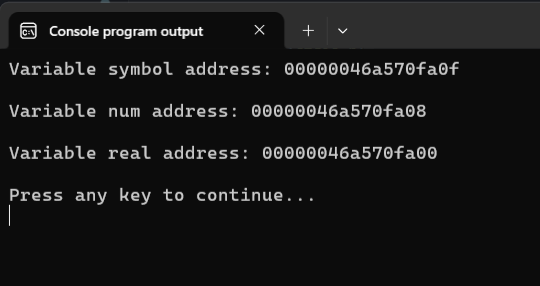

При каждом новом запуске программы адреса переменных будут изменяться.

На рисунке ниже я схематично изобразил кусочек оперативной памяти и переменные в ней. Здесь я снова предлагаю думать об оперативной памяти, как о длинной ленте пронумерованных ячеек. Размер каждой ячейки -- 1 байт (8 бит). 

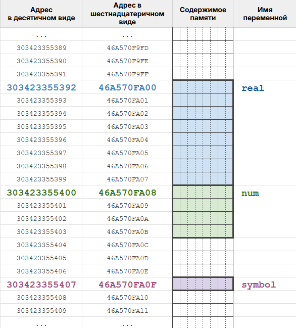

Количество ячеек, которое занимает переменная в памяти, определяется типом данных. У меня в системе переменная `symbol` занимает одну ячейку, `num` -- четыре ячейки, а `real` -- восемь ячеек. У вас переменная типа `char` тоже будет занимать `1` байт, а вот размеры переменных других типов уже могут отличаться.  

% **Обратите внимание:** для переменных, которые занимают несколько ячеек, в качестве адреса используется номер первой из них (с минимальным номером).

Теперь, когда с адресами разобрались, можно переходить к основной теме урока -- указателям.

## Что же такое указатель?

Начнём немного издалека и попытаем "поженить" два уже известных нам факта о языке Си.
1. Все функции в языке Си работают с копиями значений, которые им передаются через аргументы. При вызове функции создаются локальные переменные, описанные в заголовке функции. В эти переменные и сохраняются копии аргументов.
2. В функцию `scanf` передаются адреса переменных, а не сами переменные. 

Допустим в нашей программе есть строчка: `scanf("%d", &num);`. Вроде бы ничего необычного. Но теперь, зная как работают функции, давайте приглядимся повнимательнее. Вторым аргументом мы передаём в функцию `scanf` адрес переменной `num`. А это значит, что функция `scanf` должна создать локальную переменную, в которую запишет копию этого адреса. 

Мы уж знаем, как работать с символами, целыми и вещественными числами, но тут совсем другое дело. Здесь нужно создать переменную для хранения адреса. Мы такие переменные создавать не умеем, но раз функция `scanf` работает, то стало быть в языке Си такие переменные существуют. И этот абсолютно правильный вывод подводит нас к ответу на вопрос, вынесенный в заглавие раздела.

=Указатель (англ. pointer)= -- это переменная, которая используется для хранения адреса.

Но, конечно, мало знать, что указатели существуют и что это переменные, надо ещё и научиться ими пользоваться. Именно этим и предлагаю заняться.

Сперва научимся создавать указатели.

## Объявление указателя в C

Указатель -- это переменная, а поэтому и объявляется он как и все переменные: указываем тип данных, потом пишем имя. Разница лишь в том, что к имени типа добавляется символ `*`.

Листинг 2. Объявление указателей
```c
int * p_num;        // p_num -- указатель на int
                    // p_num хранит адрес переменной типа int

char * p_symbol;    // p_symbol -- указатель на char
                    // p_symbol хранит адрес переменной типа char
```

В Листинге 2 мы объявили два указателя (две переменных-указателя): `p_num` и `p_symbol`. Теперь в `p_num` можно сохранить адрес любой переменной типа `int`, а в `p_symbol` — адрес любой переменной типа `char`.

Имя указателя подчиняется тем же правилам, что и имена обычных переменных: только латиница, цифры и знак подчёркивания.

% **Важно!** Имя указателя обычно начинают с префикса, вроде: `p_` или `ptr_` (от англ. pointer). Такие имена позволяют молниеносно отличать указатели от любых других переменных.

### Адресные типы данных

С адресами есть небольшая проблема. Когда видишь адрес (например: `46a570fa00`), то невозможно понять, что хранится в памяти по этому адресу: символ, целое число или вещественное число. А между тем, как мы знаем, компьютеру надо знать, с какими конкретно данными он работает. 

Поэтому в языке Си нет одного общего типа данных "адрес", зато для каждого базового типа данных имеется свой =адресный (указательный) тип данных=. Для его обозначения используется символ `*`:
- `char *` -- адрес `char` (указатель на `char`);
- `int *` -- адрес `int` (указатель на `int`);
- `double *` -- адрес `double` (указатель на `double`);
- `float *` -- адрес `float` (указатель на `float`).

Вот так и появляется звёздочка в объявлении указателей. 

Резюмируем. Главное, что надо понимать про запись вида `int * p_num;`: после этого объявления в переменную `p_num` мы можем сохранить адрес любой переменной типа `int`.

Как это сделать?

## Сохранение адреса в указателе

Для того, чтобы присвоить указателю какое-то значение (сохранить адрес в указателе) используется уже известный нам оператор присваивания.

Рассмотрим простой пример.
Листинг 3. 
```c
#include <stdio.h>

int main(void)
{
        int age = 0;
        int *p_age; // объявляем p_age -- указатель на int
        p_age = &age; // адрес переменной age сохраняем в указатель p_age
                      // теперь указатель p_age хранит адрес переменной age
        
        printf("Variable age address: %p\n\n", p_age);

        printf("Enter your age:\n");
        scanf("%d", p_age); // передаём адрес переменной age, 
                            // используя указатель p_age
        
        printf("Age: %d\n", age);
        
        return 0;
}
```

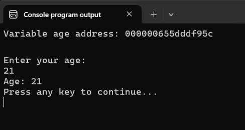

В этой программе мы передали функции `scanf` адрес переменной не так, как обычно делаем, а через указатель `p_age`, который мы предварительно объявили и присвоили ему значение `&age`. Кстати, допускается сразу инициализировать указатель `p_age` начальным значением: `int *p_age = &age;`.  

Когда мы сохранили адрес переменной `age` в указатель `p_age`, говорят, что *"указатель `p_age` указывает на переменную `age`"*. "Указывает" значит "хранит её адрес".

На одну переменную могут указывать сразу несколько указателей, в этом нет ничего страшного. Более того, мы можем присваивать указателю значение, хранящееся в другом указателе, лишь бы совпадали их типы. Проиллюстрируем это на следующем примере.

Листинг 4. 
```c
#include <stdio.h>

int main(void)
{
        int age = 21, current_year = 2026;

        // создаём три указателя на int 
        int *p_age = &age;
        int *p_year = &current_year;
        int *p_another_pointer = 0; // обнуляем указатель

        // выводим адреса, хранящиеся в указателях
        printf("p_age: %p\n", p_age);
        printf("p_year: %p\n", p_year);
        printf("p_another_pointer: %p\n\n", p_another_pointer);

        p_another_pointer = p_year; // сохраняем адрес из указателя p_year
                                    // в указатель p_another_pointer

        p_age = NULL;  // обнуляем указатель через NULL (нулевой указатель)             
        
        printf("p_age: %p\n", p_age);
        printf("p_year: %p\n", p_year);
        printf("p_another_pointer: %p\n\n", p_another_pointer);

        return 0;
}
```

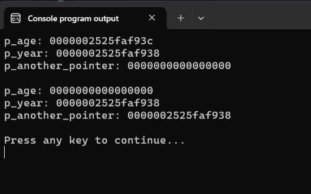

После объявления, пока мы не сохранили в указателе какое-нибудь значение, в нём, как и в обычной переменной, хранится "мусор". Чтобы "обнулить" указатель можно использовать число `0`, но лучше это делать через специальный =нулевой указатель NULL= -- адрес, который гарантированно не указывает ни на какой объект.

Разберём чуть подробнее строку `p_another_pointer = p_year;`. 

Мы берём значение, записанное в переменной `p_year` (т.е. адрес переменной `current_year`), и сохраняем это значение в переменную `p_another_pointer`. В итоге, оба указателя хранят адрес переменной `current_year` (указывают на одну и ту же переменную, на одно и то же место в памяти). Подтверждение чему мы и видим на Рисунке 4 -- адреса, которые записаны в этих переменных, совпадают.

% **Важно:** При присваивании указателей их типы должны совпадать!

В следующей программе мы попробуем нарушить это требование. Проверьте самостоятельно, что произойдёт при компиляции следующей программы.

Листинг 5. Ошибки с присваиванием указателей
```c
#include <stdio.h>

int main(void)
{
    int a = 2;
    int b = 10;
    double pi = 3.141592;
    double e = 2.718281;

    int *p_a = &a, *p_b = &b; // ОБРАТИТЕ ВНИМАНИЕ 
                              // надо ставить * около каждого имени указателя  
    double *p_pi = &pi, 
           *p_e = &e;

    p_a = p_b;  // OK, типы совпадают
    p_e = p_pi; // OK, типы совпадают

    p_b = p_e;  // опасность! разные типы указателей
    p_pi = p_a; // опасность! разные типы указателей

    return 0;
}
```

Итак, мы научились создавать указатели и сохранять в них адреса переменных. А теперь самое интересное. Оказывается (ВОТ ТАК НЕОЖИДАННОСТЬ!!1!), зная только адрес переменной, можно изменять значение этой переменной, т.е. изменять данные, записанные по этому адресу.


## Разыменование указателя

Согласитесь, что название заголовка звучит довольно странно? Мне, честно говоря, слово "разыменование" (англ. dereference) тоже не нравится, оно какое-то непонятное. Думаю, что вы уже и сами догадались, что это такое.

=Разыменование указателя= -- это обращение к ячейке памяти, адрес которой хранится в указателе.

Вместо термина "разыменование" можно использовать на мой взгляд более понятный термин =обращение по адресу=.

Итак, чтобы обратиться к памяти, используя адрес, нужно воспользоваться =оператором обращения по адресу `*`= или =оператором разыменования `*`=. 

Снова звёздочка? Да, и здесь тоже звёздочка.


Для иллюстрации того, как работает оператором обращения по адресу, рассмотрим следующий пример. 

Листинг 6. Использование оператора обращения по адресу `*`
```c
#include <stdio.h>

int main(void)
{
        int n = 5;     
        printf("n address: %p\n", &n);

        int *p_n = &n;   // теперь p_n указывает на n

        *p_n = 10;  // аналог n = 10;
        printf("n = %d\n", *p_n); // аналог printf("n = %d", n);

        int k = 0;
        k = *p_n;   // аналог k = n; 
        printf("k = %d\n", k);

        *p_n = *p_n * k; // аналог n = n * k
        printf("n = %d\n", *p_n);

        *p_n = 2 * *p_n; // аналог n = 2 * n;
        printf("n = %d\n", *p_n);
        
        return 0;
}
```

Результат работы этой программы:
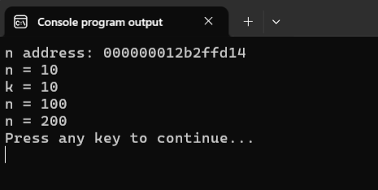

Разберём почти построчно код этой программы.

```c
int n = 5;     
printf("n address: %p\n", &n);
```
Сперва создаём переменную `n` и присваиваем ей значение `5`. Выводим адрес переменной `n`. Для наглядности давайте изобразим текущее состояние памяти.

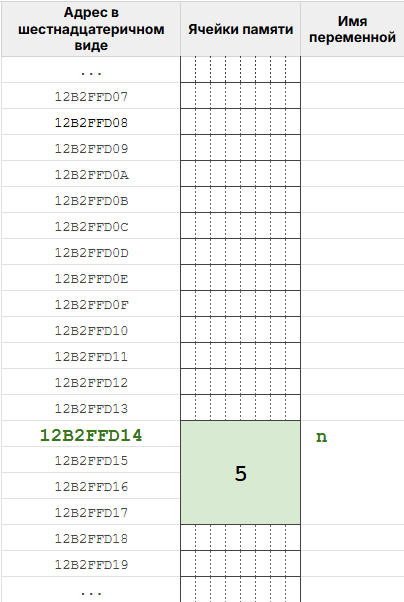

Начиная с адреса `12b2ffd14`, несколько ячеек памяти, резервируются для хранения значения типа `int`. За этой областью памяти закрепляется имя `n`. После чего в эту область памяти записывается целое число `5`. Конечно, строго говоря, значение `5` будет храниться в памяти в виде последовательности `0` и `1`, но для нашего примера это несущественно, поэтому мы всю область закрасили светло-зелёным цветом и поместили туда значение `5`.


```c
int *p_n = &n;
```

Объявляем переменную-указатель `p_n` (указатель на `int`) и сохраняем в него адрес переменной `n`. Память выглядит следующим образом. 

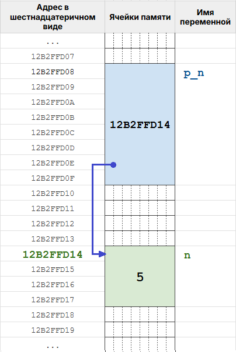

На рисунке мы видим, что начиная с адреса `12b2ffd08` (я выбрал его случайно), несколько ячеек памяти зарезервированы под хранение адреса. Мы дали этой области памяти имя `p_n` и записали туда адрес переменной `n`. Теперь переменная-указатель `p_n` указывает на переменную `n`, или говоря то же самое короче: указатель `p_n` указывает на `n`. Для наглядности на рисунке я изобразил этот факт тёмно-синей стрелкой. Понятно, что в памяти никаких стрелок нет.


Идём дальше.
```c
*p_n = 10; 
printf("n = %d\n", *p_n);
```
В первой строке мы используем оператор `*`, чтобы записать по адресу `12b2ffd14` (он хранится в указателе `p_n`) значение `10`. Иными словами, мы смотрим, куда указывает указатель (куда указывает стрелочка) и записываем в эту область памяти значение `10`. 

Таким образом, после создания указателя на переменную `n`, у нас есть два способа обратиться к этой области памяти (зелёная область на картинке): 
- по её имени (используем переменную `n`);
- по её адресу (используем оператор `*` и указатель `p_n`, т.е. `*p_n`). 

Смешная аналогия для понимания и запоминания. 
У зелёной области памяти в нашей программе есть официальное имя -- имя переменной `n`, а есть временное "прозвище" -- `*p_n`. Для работы с этой областью памяти можно использовать как имя, так и "прозвище".  

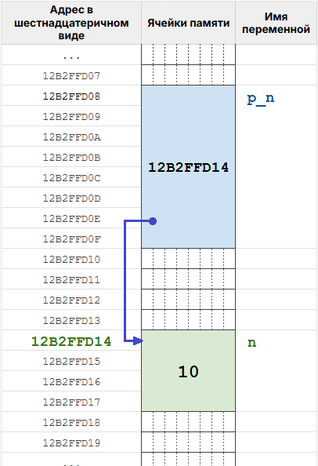

% **Обратите внимание!** 
Запись вида `*имя_указателя` означает, что мы:
1. либо объявляем новый указатель, например: `int *p_n = &n;`.
2. либо обращаемся к тому, на что указывает указатель, например: `*p_n = 10;`. Другими словами: обращаемся к объекту, который находится по адресу, записанному в указателе.

В каком смысле используется символ `*` в строке `printf("n = %d\n", *p_n);`? Очевидно, что во втором, ведь мы здесь явно не создаём новый указатель. Т.е. здесь `*p_n` это то, на что указывает указатель `p_n`, т.е. переменная `n` (обращаемся к переменной `n` по "прозвищу").

Закрепим наши знания на следующем фрагменте кода.
```c
int k = 0;
k = *p_n;   // аналог k = n; 
```

Первой строкой мы создаём в памяти переменную с именем `k` (светло-розовая область на картинке) и записываем в неё значение `0`. Это просто.

Затем во второй строке мы должны сохранить в переменную `k` значение из `*p_n`, т.е. то, на что указывает `p_n`. На что указывает `p_n`? На переменную `n`. Значит в этой строке мы сохраняем в `k` значение из переменной `n`.

Давайте то же самое, но теперь на "языке" адресов. 
1. Берём адрес из `p_n` -- `12b2ffd14`. 
2. Смотрим, что расположено в памяти по этому адресу. Там располагается значение `10` (значение переменной `n`). 
3. Берём это значение и записываем его в переменную `k`.

После выполнения этого фрагмента кода, память будет выглядеть следующим образом: 

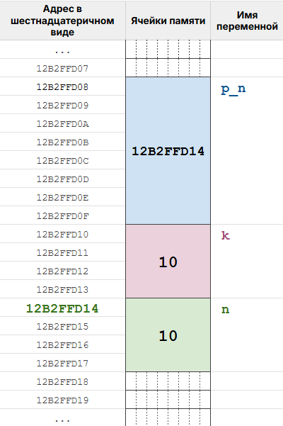

И, наконец, последние два фрагмента для тренировки:
```c
*p_n = *p_n * k;
```
В этой строке `*p_n` встречается даже два раза, но нас этим не испугаешь! Понятно, что в обоих случаях мы используем `*` как способ обратиться к перемнной `n` через указатель `p_n` (т.е. по прозвищу).

1. Берём значение, на которое указывает `p_n` (`10` из зелёной области); 
2. Умножаем его на значение переменной `k` (`10` из светло-розовой области);
3. Полученный результат сохраняем туда, куда указывает указатель `p_n` (по адресу, который хранится в `p_n`, т.е. в зелёную область). 

Теперь в переменной `n` хранится значение `100`. Состояние памяти после указанных манипуляций, представлено на следующем рисунке:

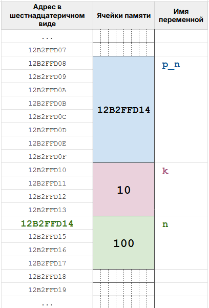

```c
*p_n = 2 * *p_n;
```

1. Берём значение, на которое указывает `p_n` (число `100`);
2. Умножаем его на `2`.
3. Новое значение (`200`) сохраняем по адресу, записанному в указателе `p_n`. 

Мы в очередной раз изменили значение в переменной `n`, через указатель на эту переменную. Итоговое состояние памяти:


Давайте подытожим.

Указатель -- переменная для хранения адреса памяти. 

Указатели предоставляют программисту альтернативный способ работы с памятью -- через адреса. Имея адрес в памяти, мы можем: 
- получить значение, которое хранится по этому адресу;
- записать по этому адресу новое значение.

Очень многие возможности языка Си реализованы (явно или неявно) через указатели. Например, масса функций стандартной библиотеки языка C, в частности функция `scanf` и любые функции, которые изменяют значение своих аргументов, используют указатели.

Схематический рисунок, иллюстрирующий основы работы с указателями:
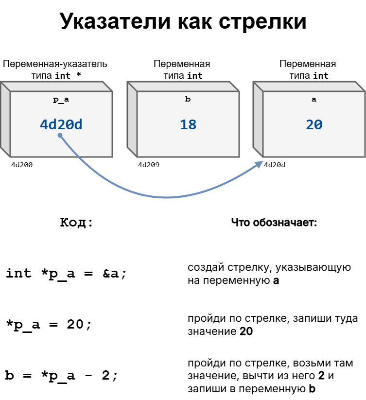
